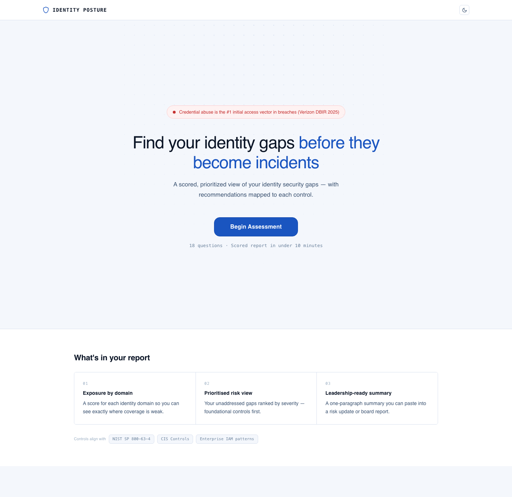

# Identity Security Posture Review

Identity Security Posture Review is a self-assessment for workforce IAM controls. It helps security and identity teams score coverage across the identity domains most often involved in credential-driven incidents, identify immediate exposure, and generate a concise summary for leadership.

Live app: [identity-posture.nalegave.com](https://identity-posture.nalegave.com)



Self-assessment only. This app is not a certification or audit attestation.

## What it does

- Scores 18 controls across Authentication & MFA, Privileged Access, Identity Lifecycle & Governance, and Monitoring & Detection
- Prioritizes unresolved gaps based on control weight and exposure
- Generates a posture summary for leadership and risk updates
- Exports results as copyable summary text, JSON, and Markdown
- Stores assessment data locally in the browser; no account required

## Stack

- React 19
- TypeScript
- Vite
- Tailwind CSS 4

## Local development

Install dependencies:

```bash
npm install
```

Start the app:

```bash
npm run dev
```

Expose the app on your local network:

```bash
npm run dev -- --host 0.0.0.0 --port 5173
```

## Verification

Run the standard checks before merging:

```bash
npm run format
npm run lint
npm test
npm run build
```

## Launch notes

- The app is designed for static hosting.
- Assessment data remains in the browser unless the user exports it.
- The repository injects a baseline Content Security Policy at build time from [`vite.config.ts`](/Users/sidnalegave-mini/Projects/web/identity-posture/vite.config.ts), but production deployments should still send security headers at the HTTP layer.
